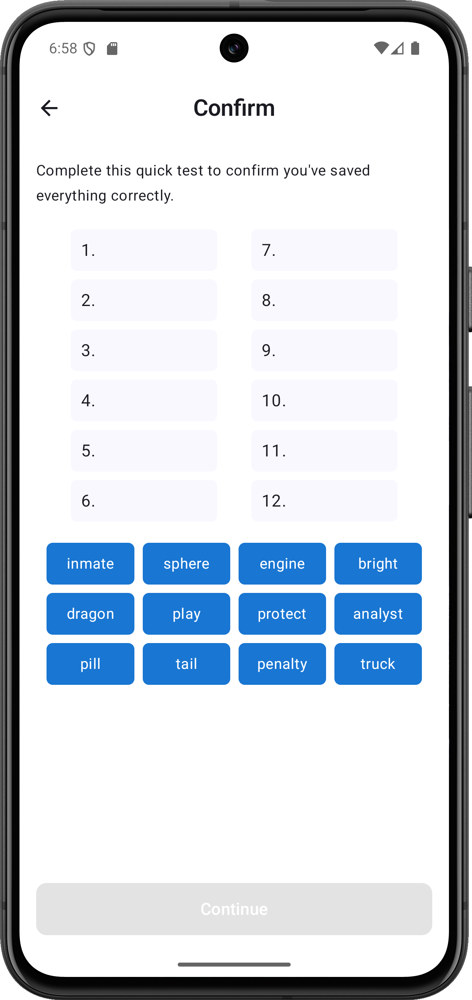
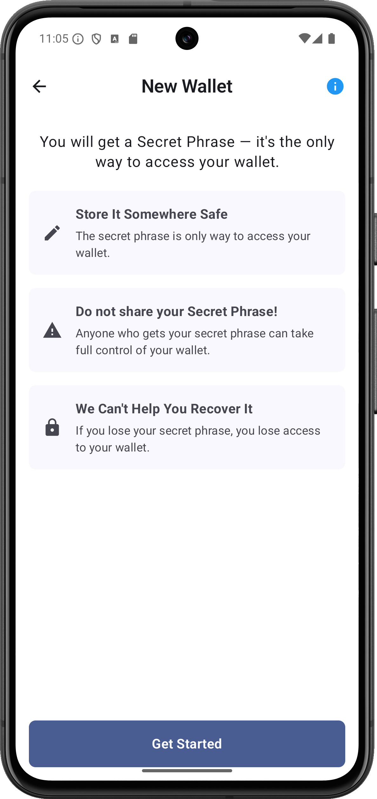
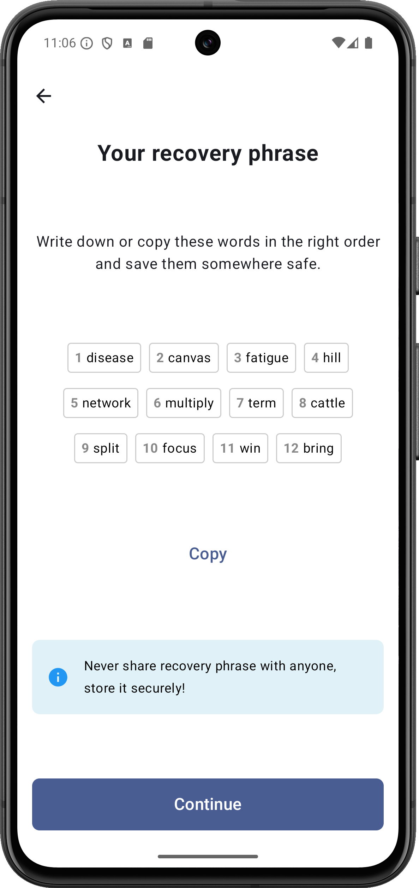

🚀 Crypto Wallet

A secure, open-source cryptocurrency wallet built with Kotlin for Android.
Easily manage your digital assets, generate wallet addresses, and send/receive transactions with a clean and intuitive UI.

---

✨ Features

🔐 Secure Key Management (BIP39 / BIP44 support)

🪙 Multi-Currency Support (Ethereum, Bitcoin, and extendable for more)

📲 Modern Android UI with Jetpack Compose

⚡ Transaction History (view, filter, track all transactions)

🌐 Real-Time Market Prices (via public APIs)

📡 Send & Receive crypto with QR code scanning

🛡️ Encrypted Storage for private keys (never leaves device)

---

📦 Installation

1. Clone the repo:

git clone https://github.com/Hassan-Ghasemzadeh/CryptoWallet.git
cd crypto-wallet

2. Open in Android Studio.

3. Add your API keys (if required) in local.properties or an .env file.

4. Build & run on device/emulator:

./gradlew assembleDebug

---

🛠️ Tech Stack

Kotlin + Jetpack Compose

Room Database (for transactions & wallets)

Coroutines / Flow for async operations

kethereum / BitcoinJ (blockchain interaction)

Hilt for dependency injection

---

🔒 Security

All private keys are encrypted and stored locally only.

---

📸 Screenshots

  

---

🤝 Contributing

Pull requests are welcome! For major changes, please open an issue first to discuss what you’d like to change.

---

📜 License

This project is licensed under the GPL-3 License – see the LICENSE file for details.
